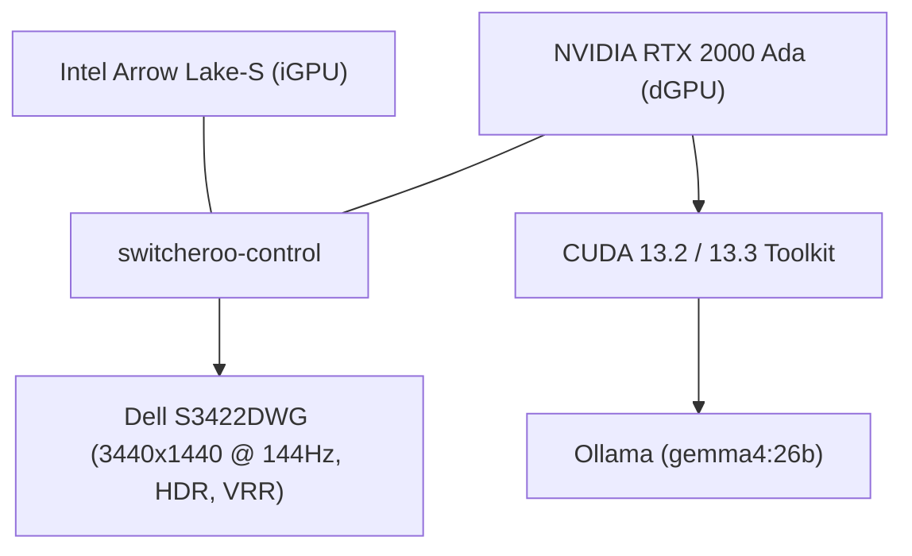

# Fedora 44 Installation & Configuration Report

This markdown file summarizes the custom configuration for my Dell Tower PC.

---

## 1. System

Your system is configured with a hybrid graphics setup running Fedora 44 under a modern Linux kernel.

### Hardware Summary
*   **Operating System**: Fedora release 44 (Forty Four)
*   **Kernel**: Linux `7.0.12-200.fc44.x86_64`
*   **Processors/Graphics**:
    *   **Integrated GPU**: Intel Corporation Arrow Lake-S (Intel Graphics)
    *   **Discrete GPU**: NVIDIA Corporation AD107GL (RTX 2000 / 2000E Ada Generation, 16GB VRAM)
*   **Primary Display**: DELL S3422DWG 34" Ultrawide monitor
    *   **Resolution**: 3440 × 1440
    *   **Refresh Rate**: 144 Hz (specifically 143.975 Hz)
    *   **Features**: Variable Refresh Rate (VRR/G-Sync) enabled, HDR (Rec. 2100 / BT.2100 color mode) enabled.



---

## 2. NVIDIA & Display Settings

*   **Driver Version**: `595.80` (Proprietary NVIDIA Driver)
*   **CUDA Version**: `13.2` (Supported by CUDA Toolkit `13.3`)
*   **Power Management**: PowerMizer Mode is set to Adaptive (`GPUPowerMizerMode=0` in `~/.nvidia-settings-rc`).
*   **Active GPU Offloading**: Managed dynamically via `switcheroo-control` under GNOME Wayland/Xwayland. Applications like Steam, Firefox, Ptyxis, and Ollama are leveraging the NVIDIA dGPU.

---

## 3. Package Management & Repositories

### DNF Configuration (`/etc/dnf/dnf.conf`)
*   `installonly_limit=10` is configured (increased from the default of 3, allowing up to 10 kernel versions to be kept on the system). (/boot is 4GiB)

### Custom Repositories Enabled
| Repo ID | Description |
| :--- | :--- |
| `rpmfusion-free` / `nonfree` | RPM Fusion repositories for codecs, drivers, and non-free software |
| `rpmfusion-nonfree-nvidia-driver` | Proprietary NVIDIA graphics driver repository |
| `rpmfusion-nonfree-steam` | Steam packaging repository |
| `cuda-fedora44-x86_64` | Official NVIDIA CUDA Repository |
| `google-chrome` | Google Chrome browser repository |
| `protonvpn-fedora-stable` | Proton VPN client repository |
| `copr:...:phracek:PyCharm` | PyCharm Community/Professional IDE repository |

---

## 4. Shell & Environment Configurations

The `.bashrc` has custom configuration scripts from `~/.bashrc.d/`. The following modifications are done:

### Path Extensions
*   `/home/galpar/.local/bin` and `/home/galpar/bin` are appended to the environment `$PATH`.

### Scripts in `~/.bashrc.d/`

> [!NOTE]
> **nvidia-gstreamer.sh**
> ```bash
> export LD_LIBRARY_PATH=/usr/lib64:$LD_LIBRARY_PATH
> ```
> *Forces GStreamer / library lookup to prioritize 64-bit system libraries, resolving potential codec loader issues. Fixes Firefox and Chrome not using hardware decoding.*

> [!NOTE]
> **ollama-aliases.sh**
> ```bash
> alias gemma='ollama run gemma4:26b'
> ```
> *An alias for interacting with local hosted Gemma 4 26B model.*

---

## 5. Desktop Environment & Personalization

*   **Window Manager**: GNOME Shell on Wayland.
*   **Autostart Configurations (`~/.config/autostart`)**:
    *   **Signal Desktop** (Flatpak version launch on login)
    *   **Steam** (RPM version launch on login)
    *   **Custom Night Theme Switcher** (A script that automatically switches between light and dark themes based on GNOME's Night Light status, using DBus monitoring for real-time changes).
*   **GNOME Shell Extensions**:
    *   `apps-menu` (Applications Menu) is enabled.
    *   `alphabetical app menu` is enabled.
*   **Theming**:
    *   `adw-gtk3` and `adw-gtk3-dark` Flatpak packages are installed to force older GTK3 applications to blend seamlessly with GNOME's modern Libadwaita (GTK4) design system.

---

## 6. Audio & Multimedia Configuration (PipeWire & WirePlumber)

### Custom WirePlumber Configuration

> [!NOTE]
> **[10-disable-headset-switch.conf](file:///home/galpar/.config/wireplumber/wireplumber.conf.d/10-disable-headset-switch.conf)**
> ```ini
> wireplumber.settings = {
>     bluetooth.autoswitch-to-headset-profile = false
> }
> ```
> *Disables automatically switching Bluetooth audio devices to the low-quality headset profile (HSP/HFP) when a microphone is activated.*


## 7. Location Services (GeoClue)

### Custom GeoClue setting

> [!NOTE]
> **[geoclue.conf] (file:///etc/geoclue/geoclue.conf)**
> Disable all geoclue sources except static source
> Create  a file named geolocation in /etc that contains your location data:
> Latitude
> Longitude
> Elevation
> Accuracy

## 8. Night Theme Switcher

### Step 1: Create the automatic switcher script

```bash
mkdir -p ~/.local/bin
nano ~/.local/bin/toggle-dark-mode.sh
```

```bash
#!/bin/bash

# Function to apply themes
set_theme() {
    if [ "$1" = "true" ]; then
        # Night Light is ON -> Switch to Dark Mode
        gsettings set org.gnome.desktop.interface gtk-theme 'adw-gtk3-dark' && gsettings set org.gnome.desktop.interface color-scheme 'prefer-dark'
    else
        # Night Light is OFF -> Switch to Light Mode
        gsettings set org.gnome.desktop.interface gtk-theme 'adw-gtk3' && gsettings set org.gnome.desktop.interface color-scheme 'prefer-light'
    fi
}

# 1. Check current real-time state via DBus property
CURRENT_STATE=$(dbus-send --session --print-reply --dest=org.gnome.SettingsDaemon.Color /org/gnome/SettingsDaemon/Color org.freedesktop.DBus.Properties.Get string:org.gnome.SettingsDaemon.Color string:NightLightActive | grep -o '[a-z]*$')

set_theme "$CURRENT_STATE"

# 2. Actively monitor the DBus for NightLightActive property changes
dbus-monitor --session "type='signal',interface='org.freedesktop.DBus.Properties',member='PropertiesChanged',path='/org/gnome/SettingsDaemon/Color'" | while read -r line; do
    # Look for the line indicating NightLightActive changed
    if echo "$line" | grep -q "NightLightActive"; then
        # Read the next line to capture the boolean value (true/false)
        read -r next_line
        NEW_STATE=$(echo "$next_line" | awk -F" " '{print $NF}')
        set_theme "$NEW_STATE"
    fi
done
```

### Step 2: Make the script executable

```bash
chmod +x ~/.local/bin/toggle-dark-mode.sh
```

### Step 3: Make it start automatically on login

```bash
mkdir -p ~/.config/autostart
nano ~/.config/autostart/toggle-dark-mode.desktop
```

```ini
[Desktop Entry]
Type=Application
Exec=sh -c "sleep 5 && bash /home/yourusername/.local/bin/toggle-dark-mode.sh"
Hidden=false
NoDisplay=false
X-GNOME-Autostart-enabled=true
Name=Night Light Theme Switcher
Comment=Syncs Light/Dark mode with GNOME Night Light status
```

### Step 4: Test it immediately

```bash
~/.local/bin/toggle-dark-mode.sh &
```
